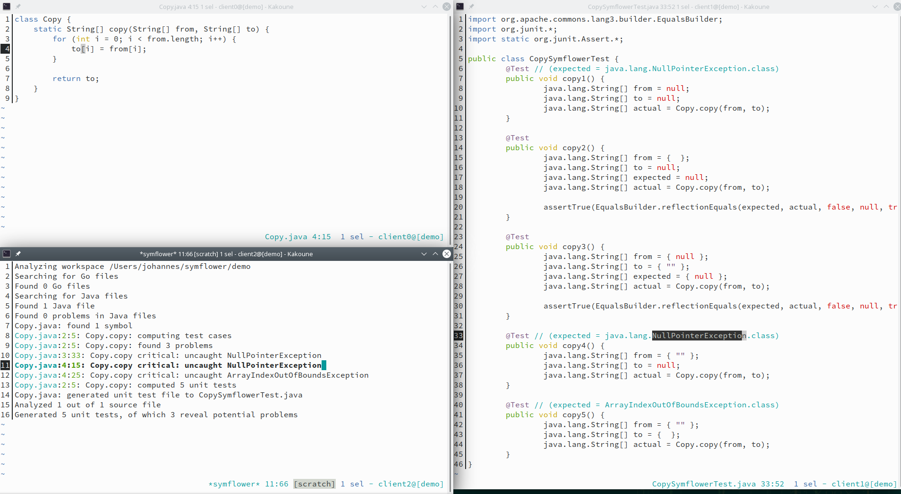

# symflower-kakoune

[Symflower](https://symflower.com/) fully automatically generates high coverage unit tests for your source code: revealing bugs and security issues while you are coding. You can equip legacy projects with strong test suites and streamline your TDD workflow with automated test case generation to find every edge case. If you are interested in our [secret sauce](https://symflower.com/en/features/symbolic-execution-rules/), take a look at our website on [https://symflower.com/](https://symflower.com/).

This plugin integrates [Symflower CLI](https://symflower.com/en/products/symflower-cli/) into the [Kakoune](https://kakoune.org) editor (version 2019.07.01 or later), so you can generate unit tests while you write code.



## Installation

1. Install [Symflower CLI](https://symflower.com/en/products/symflower-cli)
1. Load [`rc/symflower.kak`](rc/symflower.kak):

    ```sh
    git clone https://github.com/symflower/symflower-kakoune
    mkdir -p ~/.config/kak
    echo "source $PWD/symflower-kakoune/rc/symflower.kak" >> ~/.config/kak/kakrc
    ```

    Alternatively, use [plug.kak](https://github.com/andreyorst/plug.kak):

    ```kak
    plug symflower/symflower-kakoune
    ```

## Usage

- The `symflower` command generates tests for source files in the current directory.
- The `symflower-alternative-file` command jumps between a source file and the generated test file.

## Quick Start

Create a new directory and put the following file `Copy.java` in it:

```sh
mkdir sandbox
cd sandbox
cat > Copy.java << EOF
class Copy {
    static String[] copy(String[] from, String[] to) {
        for (int i = 0; i < from.length; i++) {
            to[i] = from[i];
        }

        return to;
    }
}
EOF
kak Copy.java -e symflower
```

This should write unit tests for `Copy.java` to `CopySymflowerTest.java`.

## Supported Languages

-   Go 1.16
-   Java 1.8

## Tutorials

Check out our tutorial at [https://get.symflower.com/](https://get.symflower.com/) to get a quick glimpse on how Symflower helps you implement features and fix bugs.

## Requirements

- [Kakoune](https://kakoune.org) editor (version 2019.07.01 or later)
- Supported operating systems:
  - Linux
  - MacOS
  - For others, please request the operating system on our [community issue tracker](https://github.com/symflower/symflower).

## Feedback

We encourage you to send us your feedback on how you like Symflower. If you are missing a feature or found a problem that you think should be fixed, please open an issue on our [community issue tracker](https://github.com/symflower/symflower/issues) or write us an email at [hello@symflower.com](mailto:hello@symflower.com). Subscribe to the [Symflower newsletter](https://symflower.com/en/products/symflower-cli/#newsletter-bottom-form) to receive updates on new features, use cases and topics on software development.

[© 2022 Symflower GmbH](https://symflower.com/en/imprint/)
